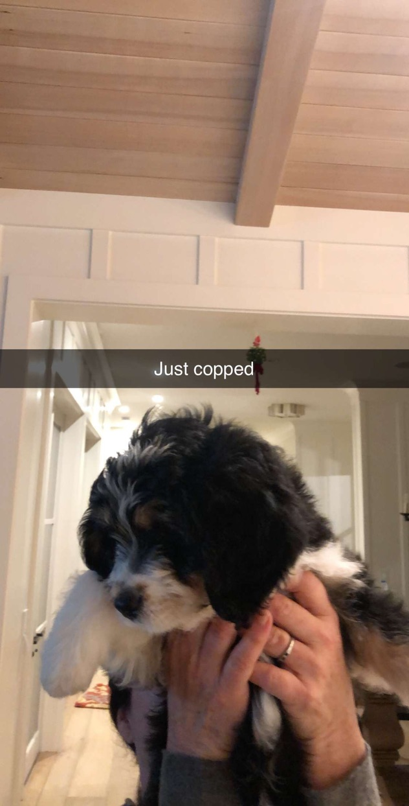

This page is about my dog Oakley.

Oakley is a mix between a Bernese Mountain Dog and a Doodle, also known as a Bernadoodle. She was born on October 17th, 2019 and we picked her up at the airport when she was 8 weeks old on December 20, 2019. She is a loving dog and is still quite untamed. She loves people and playing with other dogs. Her favorite place on the planet is the beach. Below are pictures of the mutt.

